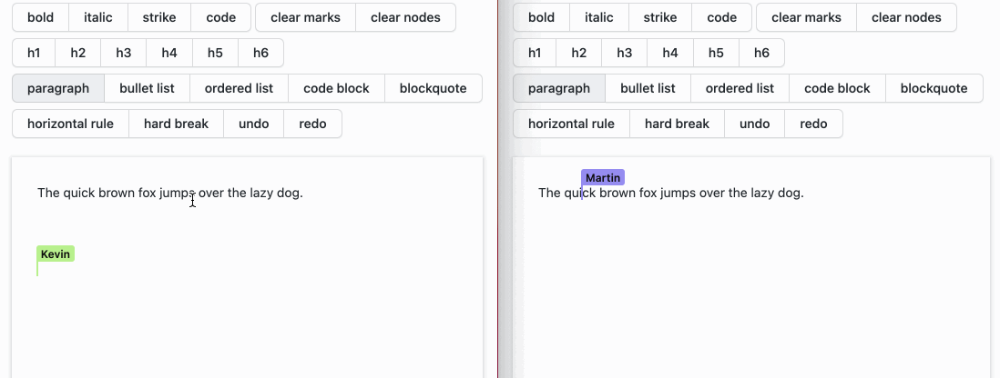

# Matrix CRDT

<a href="https://discord.gg/aDQxXezfNj"></a> <a href="https://matrix.to/#/#beyond-chat:matrix.org"></a>

[](https://badge.fury.io/js/matrix-crdt) [](https://coveralls.io/github/YousefED/Matrix-CRDT?branch=main)

Matrix-CRDT enables you to use [Matrix](https://matrix.org/) as a backend for distributed, real-time collaborative web applications that sync automatically.

The MatrixProvider is a sync provider for [Yjs](https://github.com/yjs/yjs), a proven, high performance CRDT implementation.

## TL;DR

Create apps like this:



And connect [Matrix](https://matrix.org/) as transport + backend storage. Instead of chat messages (primary use-case of Matrix), we send an event stream of data model updates (for the rich-text demo, these are _document edits_) to Matrix.

## Live demo

In the [examples](examples) directory, you'll find some live examples:

- [Collaborative Todo list](examples/todo-simple-react)
- [Collaborative rich text editing](examples/rich-text-tiptap)

## Motivation

[CRDTs](https://crdt.tech/) (_Conflict-free Replicated Data Types_) make it easy to build **decentralized**, **fast**, **collaborative** **local-first** applications.

> Read more about [the benefits of Local-first software in this essay](https://www.inkandswitch.com/local-first.html)

When building local-first software on top of CRDTs, you probably still need a backend so users can access their data across devices and collaborate with each other.

While [Matrix](https://www.matrix.org) is primarily designed for messaging (chat), it's versatile enough to use as a backend for collaborative applications (see [Architecture](#architecture)). The idea is that by building on top of Matrix, developers can focus on building clients and get the following benefits from the Matrix ecosystem out-of-the-box:

- An open standard and active community
- Multiple server implementations (including hosted servers)
- Authentication (including support for SSO and 3rd party providers)
- Access control via Rooms and Spaces
- E2EE
- A decentralized architecture with support for federation

# Usage

Matrix-CRDT currently works with [Yjs](https://github.com/yjs/yjs) or [SyncedStore](https://www.syncedstore.org).

## Usage with Yjs

To setup Matrix-CRDT, 3 steps are needed:

- Create a [Yjs](https://github.com/yjs/yjs) `Y.Doc`
- Create and authenticate a client from [matrix-js-sdk](https://matrix.org/docs/guides/usage-of-the-matrix-js-sdk)
- Create and initialize your Matrix-CRDT `MatrixProvider`

```typescript
import { MatrixProvider } from "matrix-crdt";
import * as Y from "yjs";
import sdk from "matrix-js-sdk";

// See https://matrix.org/docs/guides/usage-of-the-matrix-js-sdk
// for login methods
const matrixClient = sdk.createClient({
  baseUrl: "https://matrix.org",
  accessToken: "....MDAxM2lkZW50aWZpZXIga2V5CjAwMTBjaWQgZ2Vu....",
  userId: "@USERID:matrix.org",
});

// Create a new Y.Doc and connect the MatrixProvider
const ydoc = new Y.Doc();
const provider = new MatrixProvider(ydoc, matrixClient, {
  type: "alias",
  alias: "matrix-room-alias",
});
provider.initialize();

// array of numbers which produce a sum
const yarray = ydoc.getArray("count");

// observe changes of the sum
yarray.observe((event) => {
  // print updates when the data changes
  console.log("new sum: " + yarray.toArray().reduce((a, b) => a + b));
});

// add 1 to the sum
yarray.push([1]); // => "new sum: 1"
```

## SyncedStore

You can also use [SyncedStore](https://syncedstore.org/docs/) and use Matrix-CRDT as SyncProvider.

## API

**new MatrixProvider** (`doc`, `matrixClient`, `room`, `awareness?`, `opts?`): `MatrixProvider`

The `MatrixProvider` syncs a Matrix room with a Yjs document.

#### Parameters

| Name                   | Type                                                                | Description                                                                                                       |
| :--------------------- | :------------------------------------------------------------------ | :---------------------------------------------------------------------------------------------------------------- |
| `doc`                  | `Y.Doc`                                                             | The `Y.Doc` to sync over the Matrix room.                                                                         |
| `matrixClient`         | `MatrixClient`                                                      | A `matrix-js-sdk` client with permissions to read (and/or write) from the room.                                   |
| `room`                 | `{ type: "id"; id: string; }` or `{ type: "alias"; alias: string }` | The room ID or Alias to sync with.                                                                                |
| `awareness` (optional) | `awarenessProtocol.Awareness`                                       | A `y-protocols` Awareness instance that can be used to sync "awareness" data over the experimental webrtc bridge. |
| `opts` (optional)      | `MatrixProviderOptions` (see below)                                 | Configure advanced properties, see below.                                                                         |

**MatrixProviderOptions**

Additional configuration options that can be passed to the `MatrixProvider` constructor.

Defaults to:

```typescript
{
  // Options for `ThrottledMatrixWriter`
  writer: {
    // throttle flushing write events to matrix by 500ms
    flushInterval: number = 500,
    // if writing to the room fails, wait 30 seconds before retrying
    retryIfForbiddenInterval: number = 30000
  },
  // Options for `MatrixCRDTEventTranslator`
  translator: {
    // set to true to send everything encapsulated in a m.room.message,
    // so you can view and debug messages easily in element or other matrix clients
    updatesAsRegularMessages: false,
    // The event type to use for updates
    updateEventType: "matrix-crdt.doc_update",
    // The event type to use for snapshots
    snapshotEventType: "matrix-crdt.doc_snapshot",
  }
  // Experimental; we can use WebRTC to sync updates instantly over WebRTC.
  // See SignedWebrtcProvider.ts for more details + motivation
  enableExperimentalWebrtcSync: boolean = false
  // Options for MatrixReader
  reader: {
    // How often to send a summary snapshot (defaults to once every 30 events)
    snapshotInterval: number = 30,
  },
}
```

# Architecture

CRDT updates (in our case, Yjs document updates) are very similar to (chat) Messages, that Matrix has been optimized for.

Matrix-CRDT bridges Yjs `documents` to Matrix `Rooms`. and Yjs `updates` to Matrix `events` (regular chat messages are also a specific event type in Matrix). Yjs document updates are sent as base64-encoded events to the Matrix room.

When registering a `MatrixProvider`, we:

- Listen to new `matrix-crdt.doc_update` events in the Matrix Room, and apply updates to the Yjs document.
- Listen to Yjs document updates and send these to the Matrix room as `matrix-crdt.doc_update` events.

CRDTs are specifically designed to be _eventually consistent_. This means that the state of your data is eventually reconciled, regardless of the order of update events that reach each client or server (as long as you eventually get all updates).

This makes it possible to work offline, or for servers / clients to be out of sync for a while.

## Snapshots

To reconstruct your application state (that is, the Yjs document), we eventually need to access all previous events. When there have been a lot of updates, it would be inefficient to read the entire document / room history from Matrix.

Matrix-CRDT sends periodic snapshots that contain a summary of all previous events. When retrieving a snapshot (stored as a Matrix event with type `matrix-crdt.doc_snapshot`), clients can reconstruct application state from that snapshot and don't need to fetch events occuring before that snapshots `last_event_id` (stored on the event).

## WebRTC (experimental)

Matrix-CRDT by default throttles sent events every 500ms (for example, to prevent sending an event every keystroke when building a rich text editor). It also does not support Yjs `Awareness` updates (for presence information, etc) over Matrix.

You can use the (experimental) `WebRTC` provider to connect to peers over WebRTC and send updates (regular and Awareness updates) instantly.

Ideally, we'd replace this with Matrix Custom Ephemeral events when that [Spec](https://github.com/matrix-org/matrix-doc/pull/2477) has landed.

# Development

See [CONTRIBUTING.md](CONTRIBUTING.md) for instructions how to work with this repo (e.g.: installing and building using lerna).

# Credits

Matrix-CRDT is built as part of [TypeCell](https://www.typecell.org). TypeCell is proudly sponsored by the renowned [NLNet foundation](https://nlnet.nl/foundation/) who are on a mission to support an open internet, and protect the privacy and security of internet users. Check them out!

<a href="https://nlnet.nl"></a>
